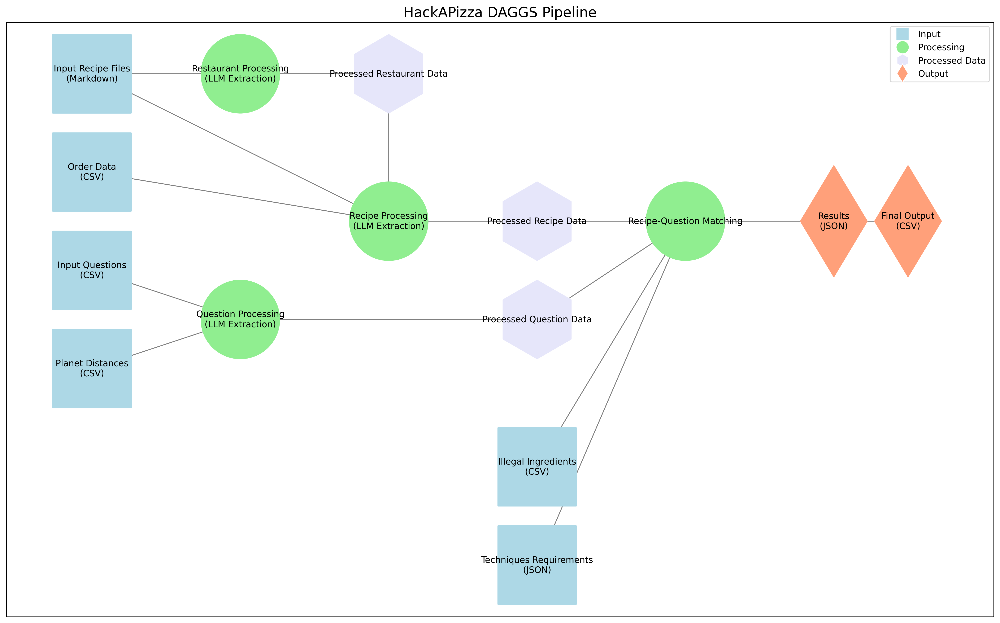

# Hackapizza Gan

This is our team solution for datapizza hackathon.

## Trace

Benvenuti e benvenute nel Ciclo Cosmico 789, dove l'umanità ha superato non solo i confini del proprio sistema solare, ma anche quelli delle dimensioni conosciute. In questo vasto intreccio di realtà e culture, la gastronomia si è evoluta in un'arte che trascende spazio e tempo.

Ristoranti di ogni tipo arricchiscono il tessuto stesso del multiverso: dai sushi bar di Pandora che servono prelibati sashimi di Magikarp e ravioli al Vaporeon, alle taverne di Tatooine dove l'Erba Pipa viene utilizzata per insaporire piatti prelibati, fino ai moderni locali dove lo Slurm compone salse dai sapori contrastanti - l'universo gastronomico è vasto e pieno di sorprese.

L'espansione galattica ha portato con sé nuove responsabilità. La Federazione Galattica monitora attentamente ogni ingrediente, tecnica di preparazione e certificazione necessaria per garantire che il cibo servito sia sicuro per tutte le specie senzienti. Gli chef devono destreggiarsi tra regolamenti complessi, gestire ingredienti esotici che esistono simultaneamente in più stati quantici e rispettare le restrizioni alimentari di centinaia di specie provenienti da ogni angolo del multiverso.

Nel cuore pulsante di questo arcipelago cosmico di sapori, si erge un elemento di proporzioni titaniche, un'entità che trascende la mera materialità culinaria: la Pizza Cosmica. Si narra che la sua mozzarella sia stata ricavata dalla Via Lattea stessa e che, per cuocerla, sia stato necessario il calore di tre soli. Nessuno conosce le sue origini e culti religiosi hanno fondato la loro fede attorno al suo mistero.

La vostra missione è sviluppare un assistente AI che aiuti i viaggiatori intergalattici a navigare in questo ricco panorama culinario.

Il sistema dovrà essere in grado di suggerire agli utenti piatti appropriati sulla base delle loro richieste:
- Interpretando domande in linguaggio naturale
- Gestendo query complesse che coinvolgono preferenze e restrizioni alimentari
- Elaborando informazioni provenienti da diverse fonti (menu, blog post, leggi galattiche e manuali di cucina)
- Verificando la conformità dei piatti con le normative vigenti

Inoltre, il vostro sistema dovrà:
- Utilizzare tecniche di Generative AI (RAG, Agenti AI) per processare e comprendere i documenti forniti
- Implementare un modulo software in grado di:
    - Ricevere in input una richiesta utente relativa a possibili piatti che corrispondono a criteri espressi in linguaggio naturale
    - Fornire in output una lista di piatti che rispettano tali criteri sulla base della documentazione fornita

Che la forza sia con voi.

## Setup

To set up the project with uv, follow these steps:

1. Clone the repository:
    ```bash
    git clone https://github.com/yourusername/hackapizza_gas.git
    cd hackapizza_gas
    ```

2. Install `uv` folowing the instructions [here](https://docs.astral.sh/uv/getting-started/installation/#installation-methods):

3. Set up dependencies using:
    ```bash
    uv sync
    ```
4. You can add and remove packages using `uv add` and `uv remove`

## Solution description

Our solution is a structured pipeline that processes recipe and question data to match user queries with appropriate dishes from the galactic culinary universe. The system leverages LLM-based extraction to understand both recipes and user questions, followed by a robust matching algorithm that accounts for various constraints like ingredients, techniques, certifications, and galactic regulations.



### Key Components

1. **Data Ingestion and Processing**:
   - Recipe processing extracts structured data from markdown files containing recipe information
   - Restaurant and chef details are extracted to validate license requirements and planetary restrictions
   - Question processing converts natural language queries into structured data with specific criteria

2. **Data Normalization**:
   - All extracted data undergoes normalization to ensure consistent matching
   - License levels are converted from Roman numerals to integers for comparison
   - Technique groups are derived from individual cooking techniques to support complex queries

3. **Matching Engine**:
   - The core matching algorithm evaluates recipes against question criteria using:
     - AND conditions (required ingredients/techniques)
     - OR conditions (alternatives accepted)
     - NOT conditions (excluded ingredients/techniques)
     - Special galactic regulations (illegal ingredient volumes, required licenses)
     - Planet distance constraints for delivery feasibility

4. **Regulatory Compliance**:
   - Verification of chef licenses against required technique certifications
   - Monitoring of restricted ingredient volumes against legal limits
   - Enforcement of planetary restrictions and compatibility

The solution provides accurate dish recommendations while ensuring compliance with all interstellar culinary regulations, helping travelers navigate the diverse gastronomic landscape of the cosmos.